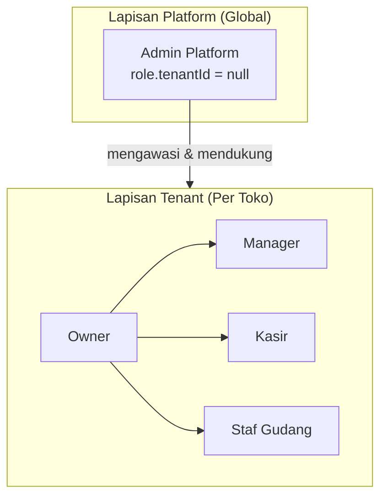
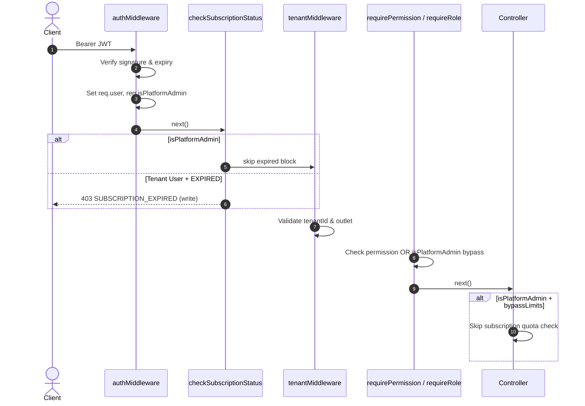
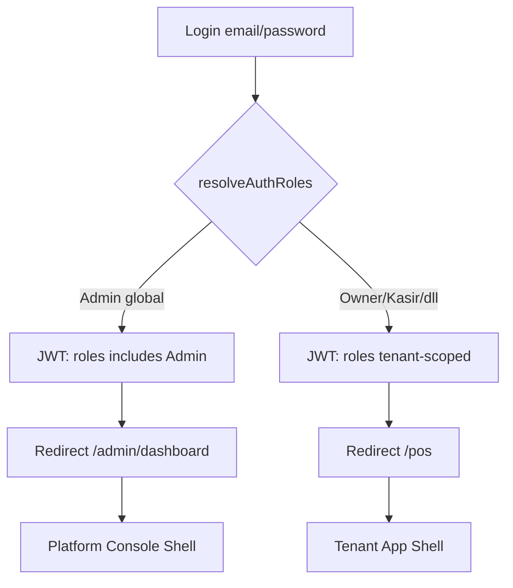
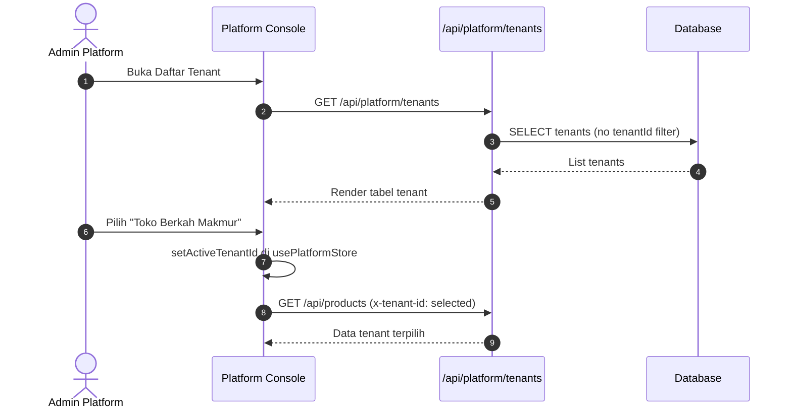

# Arsitektur & Spesifikasi Fitur Admin Platform (Platform Admin System)
## Dokumen Desain Arsitektur Perangkat Lunak — SaaSPOS UMKM

> **Dokumen Status:** Proposed (Draft Arsitektur v1)  
> **Author:** Software Architect  
> **Target System:** Backend (Express/Prisma), Frontend (React/Zustand), Auth (JWT)  
> **Dokumen Terkait:** `plan_subscription.md`, `task.md`

---

## 1. Ringkasan Eksekutif

**SaaSPOS UMKM** adalah platform POS multi-tenant. Di dalamnya terdapat dua kelompok pengguna yang **tidak boleh dicampur**:

| Kelompok | Siapa | Tujuan |
|---|---|---|
| **Tenant User** | Owner, Manager, Kasir, Staf Gudang | Mengoperasikan toko (POS, stok, laporan) |
| **Platform Admin** | Pemilik / operator SaaS | Mengelola platform, tenant, billing, dan dukungan |

Masalah yang muncul di lapangan: akun dengan role `Admin` diperlakukan seperti **staf tenant** — terikat outlet, masuk ke UI kasir, dan terkena limit langganan tenant. Padahal **Admin Platform** adalah identitas global yang berbeda dari **Owner toko**.

Dokumen ini merancang **Platform Admin System** — lapisan arsitektur yang memisahkan identitas, otorisasi, UI, dan kebijakan langganan untuk pemilik SaaS.

**Prinsip desain:**

1. **Separation of Concerns** — Platform Admin ≠ Tenant Owner
2. **Defense in Depth** — Keamanan di JWT, middleware, service layer, dan UI
3. **Tenant Context Explicit** — Admin platform selalu sadar tenant mana yang sedang diinspeksi
4. **No Outlet Binding** — Admin platform tidak diikat ke cabang toko
5. **Subscription Override Terkontrol** — Bypass limit hanya untuk operasi platform, bukan untuk semua user

---

## 2. Analisis Gap (Kondisi Saat Ini vs Target)

### 2.1 Kondisi Saat Ini (Baseline — partial implementasi)

| Aspek | Status | Catatan |
|---|---|---|
| Role global `Admin` (`tenantId = null`) | ✅ Ada | Di-seed di `backend/prisma/seed.ts` |
| Bypass permission (`requirePermission`) | ✅ Ada | `roleMiddleware.ts` → `isPlatformAdmin` |
| Bypass subscription limit | ✅ Ada | `req.isPlatformAdmin` di controller & guard |
| Verifikasi role Admin di login | ✅ Ada | `resolveAuthRoles()` — hanya role global |
| Hapus binding outlet admin | ✅ Ada | `create-admin.ts` tidak membuat `UserOutlet` |
| UI: sembunyikan outlet switcher | ✅ Ada | `OutletSwitcher`, `AppShellHeader`, `PosView` |
| UI: label "Admin Platform" | ✅ Ada | `PLATFORM_ADMIN_ROLE_LABEL` |
| Login redirect ke Dashboard | ✅ Ada | `App.tsx` → `/admin/dashboard` |
| Konsol lintas-tenant (daftar semua tenant) | ❌ Belum | Admin masih terikat satu `tenantId` di `User` |
| Tenant Switcher di UI platform | ❌ Belum | Tidak ada pemilih tenant aktif |
| API namespace `/api/platform/*` | ❌ Belum | Semua API masih `/api/*` berbasis tenant |
| Audit log aksi admin platform | ❌ Belum | Tidak ada `PlatformAuditLog` |
| Impersonate / masuk sebagai Owner | ❌ Belum | Fitur dukungan belum dirancang |

### 2.2 Akar Masalah Arsitektural

```
┌─────────────────────────────────────────────────────────────┐
│  Model User saat ini: tenantId WAJIB (NOT NULL)             │
│  → Platform Admin dipaksa punya "home tenant"               │
│  → Muncul di daftar staf tenant, terlihat seperti karyawan   │
└─────────────────────────────────────────────────────────────┘
```

Schema `User.tenantId: String` (required) membuat platform admin **selalu** menjadi bagian dari satu tenant di database, meskipun secara bisnis ia adalah operator SaaS.

---

## 3. Model Peran & Identitas (Role Model)

### 3.1 Hierarki Peran



### 3.2 Definisi Role

| Role | Scope | `Role.tenantId` | Outlet Binding | Subscription Limit |
|---|---|---|---|---|
| **Admin** (Platform) | Seluruh platform | `null` | ❌ Tidak ada | ✅ Bypass (terkontrol) |
| **Owner** | Satu tenant | `tenant.id` | Opsional (tenant-wide) | Sesuai paket tenant |
| **Manager** | Satu tenant | `tenant.id` | Per outlet / tenant-wide | Sesuai paket tenant |
| **Kasir** | Satu tenant | `tenant.id` | Wajib per outlet | Sesuai paket tenant |
| **Staf Gudang** | Satu tenant | `tenant.id` | Per outlet | Sesuai paket tenant |

### 3.3 Konstanta Kode (Single Source of Truth)

```typescript
// backend/src/lib/roles.ts & frontend/src/utils/roles.ts
PLATFORM_ADMIN_ROLE         = 'Admin'
PLATFORM_ADMIN_ROLE_LABEL   = 'Admin Platform'
TENANT_OWNER_ROLE           = 'Owner'
TENANT_WIDE_OUTLET_ROLES    = ['Owner', 'Manager', 'Admin']
```

### 3.4 Resolusi Role Aman saat Login

```typescript
// Hanya role Admin dengan tenantId = null yang masuk JWT
resolveAuthRoles(userRoles) → filter spoofing tenant-scoped "Admin"
```

**Ancaman yang dicegah:** Tenant jahat membuat role lokal bernama `Admin` untuk mem-bypass langganan.

---

## 4. Arsitektur Keamanan (Security Architecture)

### 4.1 Pipeline Middleware (Request Lifecycle)



### 4.2 Matriks Otorisasi Platform Admin

| Lapisan | Mekanisme | Bypass? |
|---|---|---|
| JWT | Role `Admin` dari role global saja | — |
| `authMiddleware` | `req.isPlatformAdmin = isPlatformAdmin(roles)` | — |
| `roleMiddleware` | `requirePermission` → bypass jika platform admin | ✅ Permission |
| `subscriptionGuard` | Skip `EXPIRED` write-block & `requireTier` | ✅ Tier guard |
| `subscriptionService` | `bypassLimits: req.isPlatformAdmin` | ✅ Kuota & fitur |
| Frontend guard | `subscriptionBypass`, `platformAdminBypass` flag API | UI only (bukan security) |

> **Peringatan keamanan:** Validasi di frontend hanya untuk UX. Semua bypass **wajib** diverifikasi di backend via `req.isPlatformAdmin` yang berasal dari JWT terverifikasi.

### 4.3 Kebijakan Subscription Bypass

Platform Admin mendapat **effective limits = ENTERPRISE** saat mengoperasikan tenant:

```typescript
// subscriptionService.ts
PLATFORM_ADMIN_EFFECTIVE_LIMITS = TIER_LIMITS[ENTERPRISE]
getSubscriptionDetails(tenantId, { bypassLimits: true })
// → platformAdminBypass: true, features: unlimited
```

**Yang tidak di-bypass:**

- Isolasi data antar tenant (tetap via `tenantId`)
- Validasi signature Midtrans webhook
- Soft-delete & audit trail data tenant

---

## 5. Model Data (Database Schema)

### 5.1 Skema Saat Ini (Relevan)

```prisma
model User {
  id       String @id
  tenantId String          // ⚠️ WAJIB — kendala utama platform admin
  email    String @unique
  // ...
  userRoles   UserRole[]
  userOutlets UserOutlet[] // Platform admin: KOSONG
}

model Role {
  id       String  @id
  tenantId String? // null = role global platform
  name     String
  @@unique([tenantId, name])
}
```

### 5.2 Evolusi Skema yang Direkomendasikan (Fase 2+)

#### Opsi A — Tenant Platform Khusus (Minimal Change)

Buat tenant sistem: `slug: platform-internal`, tidak tampil di registrasi publik. Platform admin `tenantId` mengarah ke tenant ini.

| Pro | Kontra |
|---|---|
| Tidak perlu migrasi `User.tenantId` nullable | Semantik membingungkan |
| Cepat diimplementasi | Admin tetap "terlihat" di DB sebagai user tenant |

#### Opsi B — `tenantId` Nullable untuk Platform Admin (Recommended)

```prisma
model User {
  tenantId  String?  // null hanya untuk platform admin
  userType  UserType @default(TENANT) // TENANT | PLATFORM
}

enum UserType {
  TENANT
  PLATFORM
}
```

| Pro | Kontra |
|---|---|
| Semantik jelas | Perlu migrasi & update semua query |
| Admin tidak muncul di staff tenant | Refactor `tenantMiddleware` |

#### Opsi C — Tabel Terpisah `PlatformUser` (Enterprise)

Pisahkan total identitas platform dari `User` tenant.

| Pro | Kontra |
|---|---|
| Isolasi maksimal | Duplikasi auth, kompleksitas tinggi |

**Rekomendasi arsitek:** Mulai dengan **Opsi A** (sudah de facto via `create-admin.ts`), migrasi ke **Opsi B** di Fase 2.

### 5.3 Model Baru — Konteks Tenant Aktif (Fase 2)

```prisma
// Sesi impersonasi / tenant yang sedang diinspeksi admin
model PlatformAdminSession {
  id               String   @id @default(uuid())
  platformUserId   String
  activeTenantId   String
  switchedAt       DateTime @default(now())
  ipAddress        String?
  userAgent        String?

  platformUser User   @relation(fields: [platformUserId], references: [id])
  activeTenant Tenant @relation(fields: [activeTenantId], references: [id])

  @@map("platform_admin_sessions")
}
```

### 5.4 Model Baru — Audit Log Platform (Fase 3)

```prisma
model PlatformAuditLog {
  id          String   @id @default(uuid())
  actorUserId String
  tenantId    String?  // tenant yang terdampak
  action      String   // TENANT_SUSPEND, TIER_OVERRIDE, IMPERSONATE_START, ...
  metadata    Json?
  createdAt   DateTime @default(now())

  @@index([actorUserId, createdAt])
  @@index([tenantId, createdAt])
  @@map("platform_audit_logs")
}
```

---

## 6. Arsitektur UI/UX — Dual Application Shell

### 6.1 Konsep: Dua "Shell" Terpisah

```
┌──────────────────────────────┐     ┌──────────────────────────────┐
│   PLATFORM CONSOLE SHELL     │     │     TENANT APP SHELL         │
│   (Admin Platform SaaS)    │     │     (Owner / Staf Toko)      │
├──────────────────────────────┤     ├──────────────────────────────┤
│ • Daftar Tenant              │     │ • Kasir (POS)                │
│ • Monitoring Langganan       │     │ • Produk / Stok              │
│ • Billing Global             │     │ • Outlet (cabang toko)       │
│ • Audit & Dukungan           │     │ • Staf tenant                │
│ • Tenant Switcher            │     │ • Outlet Switcher            │
│ • TIDAK ada Outlet Switcher  │     │ • Limit langganan berlaku    │
└──────────────────────────────┘     └──────────────────────────────┘
         ▲                                        ▲
         │                                        │
    isPlatformAdmin                          !isPlatformAdmin
```

### 6.2 Routing Frontend (Target)

| Path | Shell | Akses |
|---|---|---|
| `/platform/tenants` | Platform Console | Admin Platform |
| `/platform/tenants/:id` | Platform Console | Admin Platform |
| `/platform/billing` | Platform Console | Admin Platform |
| `/platform/audit` | Platform Console | Admin Platform |
| `/admin/dashboard` | Tenant App (inspeksi) | Admin Platform + Owner/Manager |
| `/pos` | Tenant App | Kasir, Manager, Owner, Admin* |
| `/admin/billing` | Tenant App | Owner, Admin Platform |

\* Admin Platform boleh akses `/pos` untuk debugging, tetapi **bukan** landing page default.

### 6.3 Perilaku UI yang Sudah Diimplementasi (Fase 0)

| Komponen | Perilaku Platform Admin |
|---|---|
| `App.tsx` | Redirect login → `/admin/dashboard` |
| `AppShellHeader` | Sembunyikan `OutletSwitcher`, badge "Lintas Tenant" |
| `PosView` | Badge "Admin Platform SaaS", outlet resolve silent (background) |
| `StaffManagementView` | Kolom outlet: "Lintas Tenant", subtitle panel platform |
| `OutletSwitcher` | Return `null` |

### 6.4 Tenant Switcher (Fase 2 — Belum Ada)

Komponen baru `TenantSwitcher` di Platform Console:

```
┌─────────────────────────────────────────┐
│  Tenant Aktif: [Toko Berkah Makmur ▼]   │
│  Paket: FREE | Status: ACTIVE | 0 SKU   │
└─────────────────────────────────────────┘
```

- Menyimpan `activeTenantId` di `usePlatformStore` (Zustand)
- Header API: `x-tenant-id` diisi dari tenant aktif, bukan `user.tenantId` default
- Persist di `localStorage` key `platform-active-tenant`

---

## 7. Desain API (Backend)

### 7.1 Namespace Saat Ini

Semua endpoint tenant-scoped: `/api/products`, `/api/subscriptions`, dll.  
Platform admin menggunakan header `x-tenant-id` + JWT role `Admin`.

### 7.2 Namespace Target — `/api/platform/*` (Fase 2)

| Method | Endpoint | Deskripsi |
|---|---|---|
| `GET` | `/api/platform/tenants` | Daftar semua tenant (paginated, filter) |
| `GET` | `/api/platform/tenants/:id` | Detail tenant + subscription summary |
| `PATCH` | `/api/platform/tenants/:id/status` | Suspend / activate tenant |
| `PATCH` | `/api/platform/tenants/:id/subscription` | Override tier (manual, audited) |
| `GET` | `/api/platform/tenants/:id/users` | Daftar user dalam tenant |
| `GET` | `/api/platform/subscriptions/invoices` | Semua invoice lintas tenant |
| `GET` | `/api/platform/audit-logs` | Audit log aksi admin |
| `POST` | `/api/platform/impersonate/:userId` | Mulai sesi impersonate (Fase 3) |

**Middleware khusus:**

```typescript
// platformAdminMiddleware.ts
export function requirePlatformAdmin(req, res, next) {
  if (!req.isPlatformAdmin) {
    return res.status(403).json({ error: 'PLATFORM_ADMIN_REQUIRED' });
  }
  next();
}
```

### 7.3 Header Kontrak API

| Header | Tenant User | Platform Admin |
|---|---|---|
| `Authorization` | `Bearer <jwt>` | `Bearer <jwt>` |
| `x-tenant-id` | `user.tenantId` | `activeTenantId` (dari switcher) |
| `x-outlet-id` | Outlet aktif kasir | Opsional / auto-resolve silent |

---

## 8. Matriks Fitur Platform Admin

| Fitur | Fase 0 (Done) | Fase 1 | Fase 2 | Fase 3 |
|---|---|---|---|---|
| Bypass permission | ✅ | — | — | — |
| Bypass subscription limit | ✅ | — | — | — |
| Verifikasi role global di login | ✅ | — | — | — |
| Tanpa outlet binding | ✅ | — | — | — |
| UI label & navigasi platform | ✅ | — | — | — |
| Login redirect ke Dashboard | ✅ | — | — | — |
| Dedicated Platform Console layout | — | ✅ | — | — |
| Daftar & detail semua tenant | — | — | ✅ | — |
| Tenant Switcher | — | — | ✅ | — |
| Override tier manual (audited) | — | — | ✅ | — |
| Suspend / activate tenant | — | — | ✅ | — |
| Audit log platform | — | — | — | ✅ |
| Impersonate Owner (dukungan) | — | — | — | ✅ |
| Notifikasi lintas-tenant | — | — | — | ✅ |

---

## 9. Alur Proses (Flow Diagrams)

### 9.1 Login & Routing



### 9.2 Inspeksi Tenant oleh Platform Admin (Fase 2)



### 9.3 Provisioning Admin Platform

```bash
# Script resmi — TIDAK boleh manual insert ke DB
cd backend && npx tsx src/scripts/create-admin.ts
```

**Kontrak script `create-admin.ts`:**

1. Cari / tentukan tenant anchor (saat ini: tenant pertama atau slug tertentu)
2. Upsert user dengan email platform admin
3. Assign **hanya** `Role` global (`tenantId = null`, name = `Admin`)
4. **Jangan** buat `UserOutlet`
5. **Jangan** assign role Owner/Kasir

---

## 10. Strategi Implementasi (Fase Pengembangan)

### Fase 0 — Fondasi Identitas & Bypass (✅ Selesai)

- [x] `resolveAuthRoles()` — anti-spoofing role Admin
- [x] `req.isPlatformAdmin` di middleware
- [x] Subscription bypass terkontrol
- [x] UI: sembunyikan outlet, label Admin Platform
- [x] `create-admin.ts` tanpa outlet binding
- [x] Unit test: `roles.test.ts`, `subscriptionGuard.test.ts`, `subscriptionService.test.ts`

### Fase 1 — Platform Console Shell (Sprint Berikutnya)

- [ ] Layout baru `PlatformConsoleLayout.tsx` (sidebar khusus platform)
- [ ] Route group `/platform/*` di `App.tsx`
- [ ] Pisahkan navigasi: platform admin tidak melihat menu Kasir sebagai default
- [ ] `usePlatformStore` — state `activeTenantId`, `activeTenantMeta`
- [ ] Halaman placeholder: Dashboard Platform, Tenant List (empty state)

### Fase 2 — Tenant Management API & UI

- [ ] Migrasi skema: `User.tenantId` nullable ATAU tenant platform internal
- [ ] `platformAdminRoutes.ts` + `platformTenantController.ts`
- [ ] `TenantSwitcher` component
- [ ] Halaman `/platform/tenants` — CRUD read + suspend
- [ ] Override subscription tier manual + `PlatformAuditLog`
- [ ] Exclude platform admin dari daftar staf tenant (`staffService` filter)

### Fase 3 — Dukungan & Observabilitas

- [ ] Impersonate flow (time-boxed token, banner "Anda login sebagai...")
- [ ] Audit log viewer `/platform/audit`
- [ ] Alert: tenant mendekati limit, pembayaran gagal, churn risk
- [ ] Export data tenant (GDPR / backup request)

---

## 11. Edge Cases & Kebijakan

### 11.1 Platform Admin di Daftar Staf Tenant

**Masalah:** User dengan role global `Admin` tetap punya `tenantId`, sehingga muncul di `StaffManagementView`.

**Kebijakan Fase 2:**

```typescript
// staffService.listStaff — exclude platform admins
where: {
  userRoles: {
    none: { role: { name: 'Admin', tenantId: null } }
  }
}
```

**Kebijakan UI Fase 0 (sementara):** Tampilkan badge "Lintas Tenant" di kolom outlet, bukan nama cabang.

### 11.2 Platform Admin Mengakses POS

- Diperbolehkan untuk **QA / demo / dukungan**
- Outlet di-resolve **silent** di background (tidak ditampilkan)
- Bukan pengalaman utama — landing page tetap Dashboard

### 11.3 Tenant Membuat Role "Admin" Lokal

- `resolveAuthRoles()` memfilter role ini saat login
- JWT tidak akan mengandung `Admin` → tidak ada bypass
- Opsional Fase 2: validasi saat `createRole` — larang nama `Admin` di tenant scope

### 11.4 Multi Platform Admin

- Saat ini: satu role global, banyak user bisa di-assign
- Fase 3: audit per `actorUserId`
- Tidak ada hierarki super-admin vs admin (YAGNI)

---

## 12. Checklist Verifikasi (QA)

| ID | Kasus Uji | Ekspektasi |
|---|---|---|
| PA-01 | Login sebagai Admin Platform | Redirect ke `/admin/dashboard`, badge "Admin Platform" |
| PA-02 | Login sebagai Owner | Redirect ke `/pos`, tidak ada bypass langganan |
| PA-03 | Tenant buat role lokal "Admin" | User tersebut **tidak** mendapat bypass di JWT |
| PA-04 | Platform Admin POST produk saat tenant FREE (30 SKU penuh) | ✅ Berhasil (bypass limit) |
| PA-05 | Kasir POST produk saat limit penuh | ❌ 403 `LIMIT_EXCEEDED` |
| PA-06 | Platform Admin di halaman Staf | Kolom outlet = "Lintas Tenant", bukan nama cabang |
| PA-07 | Platform Admin | Outlet switcher **tidak** tampil di header |
| PA-08 | Platform Admin tenant EXPIRED | Write operation tetap berhasil (bypass guard) |
| PA-09 | Owner tenant EXPIRED | Write operation diblokir 403 |
| PA-10 | `create-admin.ts` dijalankan ulang | Tidak ada record `UserOutlet` untuk admin |
| PA-11 | API tanpa JWT Admin, header spoof `x-tenant-id` | 401 / 403 — tidak ada bypass |
| PA-12 | Logout → login ulang Admin | JWT baru dengan role terverifikasi |

---

## 13. Struktur File (Referensi Implementasi)

```
backend/
├── src/
│   ├── lib/roles.ts                    # resolveAuthRoles, isPlatformAdmin
│   ├── middlewares/
│   │   ├── authMiddleware.ts           # req.isPlatformAdmin
│   │   ├── roleMiddleware.ts           # permission bypass
│   │   ├── subscriptionGuard.ts        # expired/tier bypass
│   │   └── platformAdminMiddleware.ts  # (Fase 2) requirePlatformAdmin
│   ├── routes/
│   │   └── platformRoutes.ts           # (Fase 2) /api/platform/*
│   ├── controllers/
│   │   └── platformTenantController.ts # (Fase 2)
│   ├── services/
│   │   ├── subscriptionService.ts      # bypassLimits option
│   │   └── platformTenantService.ts    # (Fase 2)
│   └── scripts/create-admin.ts         # provisioning admin

frontend/
├── src/
│   ├── utils/roles.ts                  # isPlatformAdmin, getRoleDisplayLabel
│   ├── store/
│   │   ├── useAuthStore.ts
│   │   └── usePlatformStore.ts         # (Fase 2) activeTenantId
│   ├── layouts/
│   │   └── PlatformConsoleLayout.tsx   # (Fase 1)
│   └── components/
│       ├── AppShellHeader.tsx          # dual shell header tenant
│       ├── OutletSwitcher.tsx          # hidden for platform admin
│       ├── TenantSwitcher.tsx          # (Fase 2)
│       └── platform/                   # (Fase 1-2) halaman konsol
```

---

## 14. Keputusan Arsitektural (ADR Ringkas)

| # | Keputusan | Alasan | Alternatif yang Ditolak |
|---|---|---|---|
| ADR-01 | Role `Admin` hanya valid jika `Role.tenantId = null` | Cegah spoofing bypass oleh tenant | Trust role name saja |
| ADR-02 | Bypass subscription via `req.isPlatformAdmin`, bukan flag di JWT | Flag JWT bisa dimanipulasi jika secret bocor; role lebih semantik | `isSuperUser: true` di JWT payload |
| ADR-03 | Platform admin tanpa `UserOutlet` | Admin SaaS bukan karyawan cabang | Bind ke MAIN outlet untuk "kemudahan" |
| ADR-04 | Effective limits = ENTERPRISE saat bypass | Cukup untuk operasi penuh tanpa ubah tier tenant di DB | Langsung ubah `subscriptionTier` tenant |
| ADR-05 | Fase 2: namespace `/api/platform/*` terpisah | Pemisahan jelas, mudah di-rate-limit & audit | Flag query `?platform=true` |
| ADR-06 | Landing Admin → Dashboard, bukan POS | Sesuai persona pemilik SaaS, bukan kasir | Tetap ke `/pos` |

---

## 15. Glosarium

| Istilah | Definisi |
|---|---|
| **Platform Admin** | Pemilik/operator SaaSPOS; role global `Admin` dengan `tenantId = null` |
| **Tenant** | Satu toko/UMKM yang berlangganan SaaSPOS |
| **Owner** | Pemilik toko; role tertinggi di dalam satu tenant |
| **Tenant Context** | `tenantId` aktif yang menjadi scope semua query data |
| **Bypass Limits** | Platform admin tidak terkena kuota langganan tenant yang sedang diinspeksi |
| **Lintas Tenant** | Kemampuan admin platform mengakses data lebih dari satu tenant |
| **Platform Console** | UI shell khusus admin platform, terpisah dari UI operasional toko |

---

*Dokumen ini akan diperbarui seiring implementasi Fase 1–3. Perubahan breaking pada model `User.tenantId` wajib didiskusikan sebelum migrasi production.*
